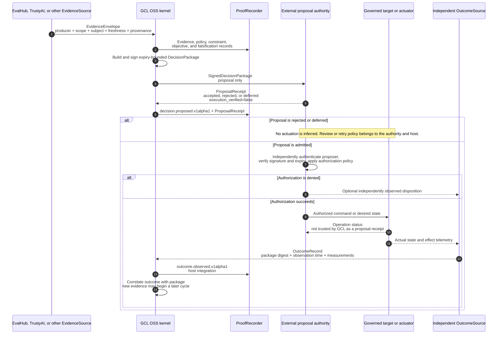

# Closed-loop authority and outcome workflow

This reference workflow shows how GCL can participate in a governed loop without
becoming the authority or actuator. The GCL alpha implements the evidence-to-proposal
path and the `OutcomeSource` contract. A production proposal consumer, actuator, and
outcome adapter are host integrations, not current end-to-end claims.

## Non-equivalence rule

These records answer different questions:

- `ProposalReceipt` says whether a consumer received or admitted a proposal.
- An authority's operation record says what it attempted after separate authorization.
- `OutcomeRecord` says what an independent source later observed.

None may be silently substituted for another, and only the independent observation
can support an execution or effect claim.
