# TrustyAI ecosystem architecture

This is the proposed product-level integration map. Solid green components are
implemented in the GCL OSS alpha. Dashed components are planned adapters or
host-provided integrations. External authorities remain outside GCL by design.

```mermaid
flowchart LR
    subgraph TAI["TrustyAI evidence and safety systems"]
        EH["EvalHub<br/>terminal evaluation jobs<br/>implemented P0"]
        TAS["TrustyAI Service<br/>drift and group fairness<br/>implemented P0"]
        GO["Guardrails Orchestrator<br/>aggregate detector behavior<br/>planned P1"]
        PA["Prometheus and Alertmanager<br/>scheduled metrics and transitions<br/>planned P1"]
    end

    OCI["OCI registry<br/>digest-pinned evaluation artifacts"]

    subgraph GCL["GCL OSS: proposal-only governance"]
        EA["EvalHub adapter<br/>terminal-state normalization"]
        AV["ArtifactVerifier<br/>manifest and descriptor verification"]
        TA["TrustyAI Service adapter<br/>compute-response normalization"]
        FA["Future evidence adapters"]
        EP["EvidenceEnvelope<br/>scope, freshness, provenance"]
        PP["Versioned policy packs<br/>evidence admission"]
        GK["Governance kernel<br/>constraints → objective → candidates<br/>invariant checks → falsification"]
        DP["SignedDecisionPackage<br/>Ed25519, digest, scope, expiry"]
        PS["ProposalSink port"]
        PR["ProofRecorder port"]
        TS["TelemetrySink port"]
        OS["OutcomeSource port"]
    end

    subgraph AUTH["External authority: never owned by GCL"]
        HR["Human review or approval workflow"]
        MC["Admission service, workflow engine,<br/>or Kubernetes controller"]
        ACT["Authorized actuator"]
    end

    PROOF["Append-only or OCI proof store<br/>planned host integration"]
    OTEL["OpenTelemetry backend<br/>planned host integration"]
    TARGET["Model deployment or governed target"]
    OBS["Independent telemetry or auditor"]

    EH -->|"EvaluationJobResource"| EA
    EH -->|"OCI reference and digest"| OCI
    OCI -->|"verified bytes and descriptors"| AV
    TAS -->|"authenticated metric response"| TA
    GO -.->|"windowed detector evidence"| FA
    PA -.->|"metrics and state changes"| FA

    EA --> EP
    AV --> EP
    TA --> EP
    FA -.-> EP
    EP --> PP
    PP --> GK
    GK --> DP
    DP --> PS
    GK --> PR
    GK -.-> TS

    PS -->|"proposal only"| HR
    PS -->|"proposal only"| MC
    HR -->|"separate authorization"| ACT
    MC -->|"separate authorization"| ACT
    ACT --> TARGET

    PR -.-> PROOF
    TS -.-> OTEL
    TARGET --> OBS
    OBS -.->|"OutcomeRecord, not a proposal receipt"| OS
    OS -.->|"correlated evidence for a later cycle"| EP

    classDef implemented fill:#e8f5e9,stroke:#2e7d32,color:#102a13,stroke-width:2px;
    classDef planned fill:#f4f4f4,stroke:#6b6b6b,color:#202020,stroke-width:1px,stroke-dasharray:5 5;
    classDef external fill:#fff3e0,stroke:#a65f00,color:#321d00,stroke-width:2px;
    classDef contract fill:#e8eef9,stroke:#315a9b,color:#10213d,stroke-width:2px;

    class EH,TAS,EA,AV,TA,EP,PP,GK,DP implemented;
    class GO,PA,FA,PR,TS,OS,PROOF,OTEL planned;
    class HR,MC,ACT,TARGET,OBS external;
    class PS,OCI contract;
```

## Architectural decision

TrustyAI and EvalHub remain authoritative for evaluation and metric computation. GCL
does not reproduce those algorithms. It binds their results to explicit evidence,
applies separately versioned governance policy, and offers a signed proposal to an
independent authority. Guardrails is intentionally outside the synchronous token path;
only aggregated behavior is a candidate input to a future GCL adapter.
