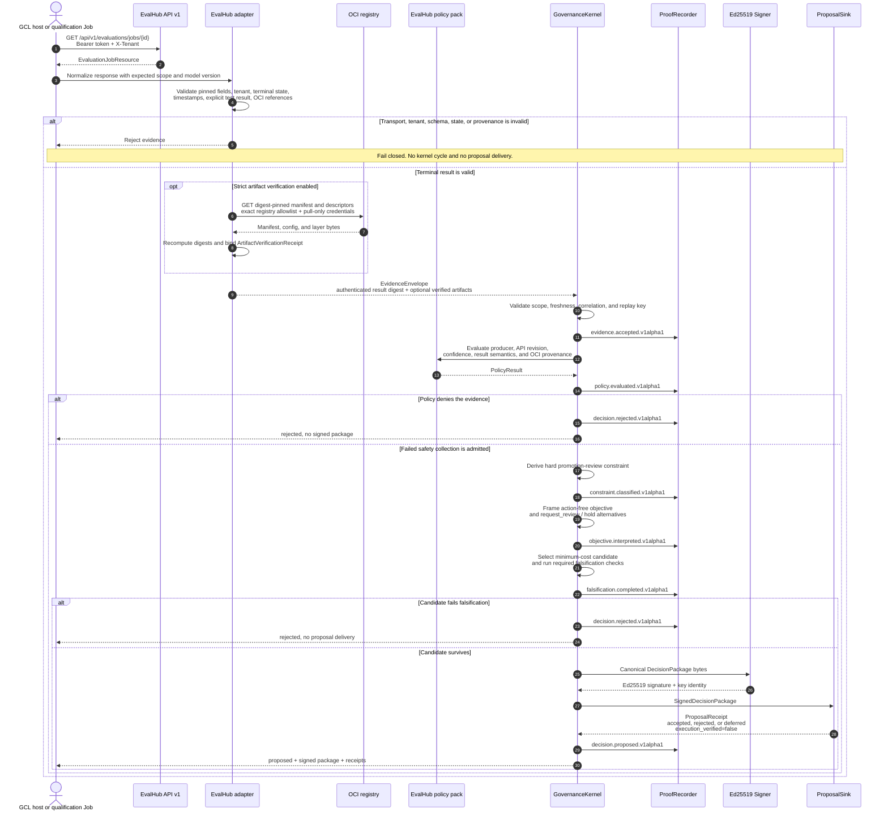

# EvalHub pre-deployment event workflow

This sequence shows the implemented failed-safety path. OCI byte verification is an
optional strict host mode; digest-pinned OCI provenance is required by the default
EvalHub policy even when the host does not fetch the bytes.

## Contract boundary

EvalHub owns job execution, benchmark results, collection semantics, and result
artifacts. GCL's adapter owns only transport and normalization. The policy pack owns
the mapping from admitted evidence to a promotion-review constraint, and the external
proposal consumer owns every authorization or deployment decision.
