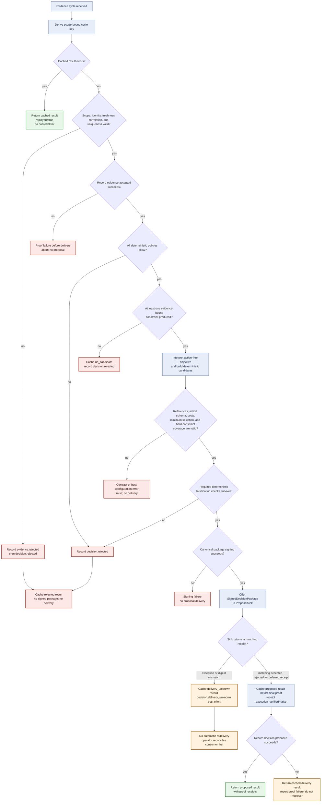

# Failure and recovery workflow

This diagram follows the implemented kernel ordering. Every gate before proposal
delivery fails closed. Ambiguous delivery is cached and requires reconciliation rather
than automatic retry.

## Recovery rules

1. Exact retries return the cached result and never redeliver automatically.
2. A sink exception or digest-mismatched receipt is `delivery_unknown`; the consumer
   must be reconciled before an operator deliberately clears or supersedes the result.
3. Successful delivery is cached before the final proof write, so a proof-store outage
   after acknowledgement cannot cause duplicate consequential work.
4. The built-in cache and lock are process-local. Multi-process or multi-replica hosts
   need durable distributed idempotency before claiming the same behavior.
