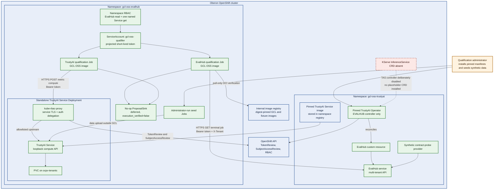

# Oberon deployment and trust boundaries

This diagram documents the isolated qualification topology used on Oberon. It is not a
supported Red Hat deployment or a production GCL topology. All runtime proposals end
at a no-op sink with `execution_verified=false`.

## What the topology qualifies

The EvalHub path qualifies tenant-scoped authenticated reads, normalization,
digest-pinned OCI manifest and descriptor verification, policy, signing, and no-op
proposal delivery. The TrustyAI path qualifies authenticated compute, pinned response
normalization, runtime policy, signing, and no-op proposal delivery. It does not
qualify model execution, a production authority, or operator-managed TrustyAI Service
on a KServe-enabled cluster.
