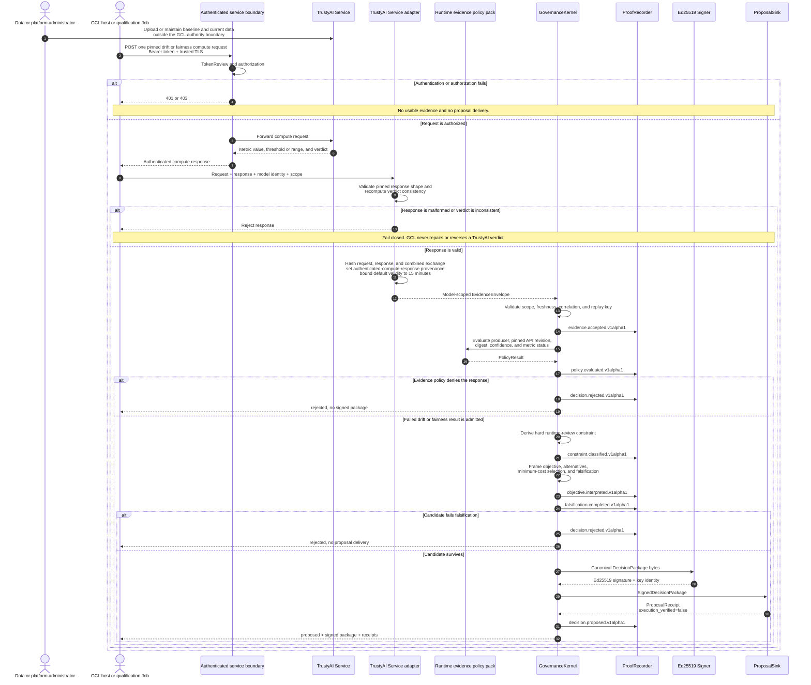

# TrustyAI runtime event workflow

This sequence shows the implemented runtime drift and fairness path. GCL calls only six
pinned compute endpoints. Data upload, schedules, and TrustyAIService resource changes
remain administrator or TrustyAI responsibilities.

## Provenance limit

The exchange digest detects mutation of the request and response retained by GCL. It
is not a TrustyAI signature or immutable result identifier. Until TrustyAI exposes a
source timestamp or immutable result reference, the adapter labels the provenance
honestly and keeps the evidence window short.
